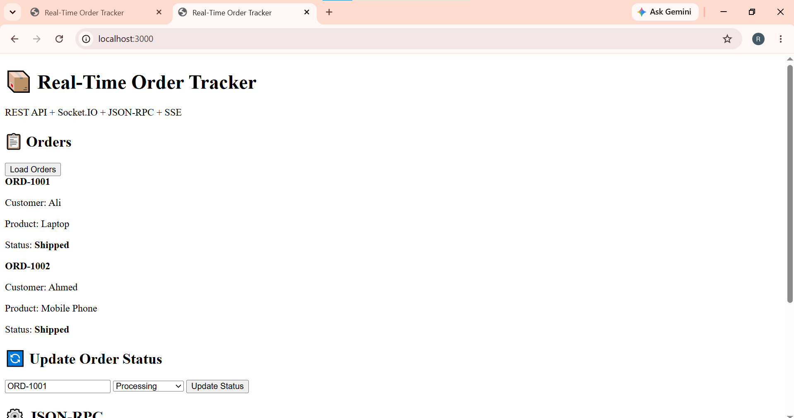
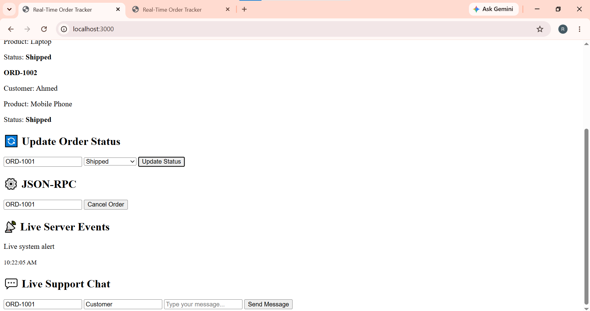
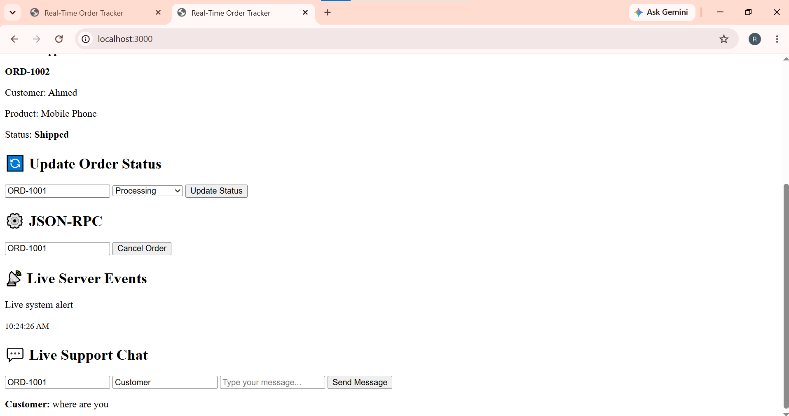
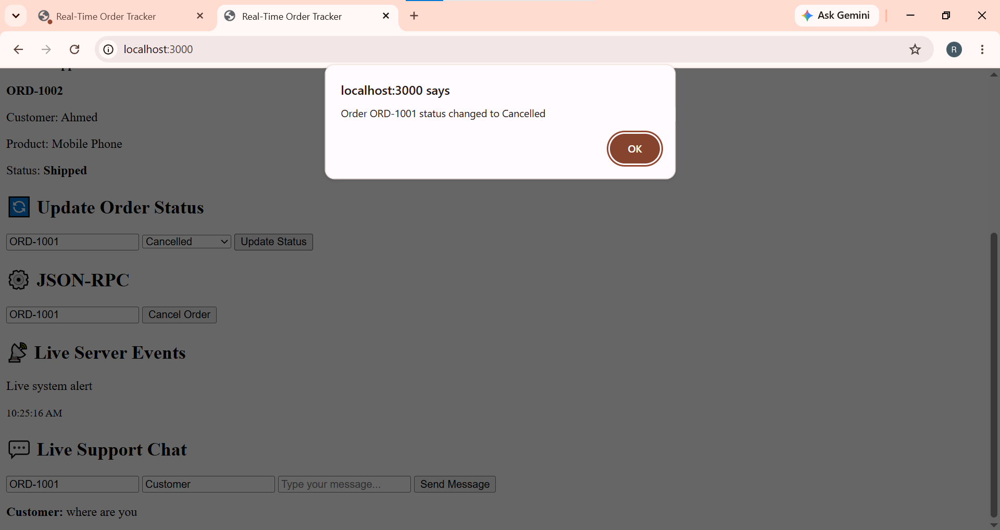

Real-Time Order Tracker & Live Support System

A full-stack real-time web application demonstrating REST APIs, WebSockets, JSON-RPC 2.0, and Server-Sent Events (SSE).

👨‍🎓 Student Information

Name: Rana Muhammad Ali
Registration No: SP24-BSE-023
Program: BS Software Engineering
University: COMSATS University

🚀 Project Overview

This project is a real-time order tracking and live customer-support system.

It demonstrates different web communication technologies working together:

- REST API for order/resource management
- Socket.io for real-time communication
- Real-time order status updates
- Live customer-support chat
- JSON-RPC 2.0 for method-based operations
- Server-Sent Events (SSE) for live server notifications

🛠️ Technologies Used

- HTML5
- CSS3
- JavaScript
- Node.js
- Express.js
- Socket.io
- REST API
- JSON-RPC 2.0
- Server-Sent Events

📡 Communication Protocols

1. REST API

REST APIs are used for managing application resources such as orders.

Example:

GET /api/v1/orders

2. WebSockets / Socket.io

Socket.io provides real-time bidirectional communication between the client and server.

Used for:

- Real-time order status updates
- Live customer-support chat
- Instant updates without refreshing the page

3. JSON-RPC 2.0

JSON-RPC provides method-based communication between the client and server.

Example endpoint:

/rpc

4. Server-Sent Events (SSE)

SSE allows the server to continuously send live events and notifications to connected clients.

Example endpoint:

/events

📂 Project Structure

real-time-order-tracker/
│
├── public/
│   ├── app.js
│   ├── index.html
│   └── style.css
│
├── screenshots/
│   ├── Chat.png
│   ├── Main UI.png
│   ├── Order.png
│   └── Status.png
│
├── server.js
├── package.json
├── package-lock.json
└── .gitignore

# 📸 Project Screenshots

## Main UI

## Order Tracking

## Real-Time Chat

## Status Update

▶️ Run Locally

Clone the repository:

git clone https://github.com/ranamuhammadali378-sys/real-time-order-tracker.git

Open the project:

cd real-time-order-tracker

Install dependencies:

npm install

Start the server:

node server.js

Open in browser:

http://localhost:3000

🌐 Deployment

Backend

The Node.js backend will be deployed using Render/Railway.

Frontend

The frontend will be deployed using Vercel/Netlify.

🎯 Assignment Requirements

Requirement| Implementation
REST API| Express REST API
Real-Time Communication| Socket.io
Live Chat| Socket.io
JSON-RPC 2.0| "/rpc"
Server-Sent Events| "/events"
Frontend| HTML, CSS, JavaScript
Backend| Node.js + Express
Repository| GitHub

👨‍💻 Author

Rana Muhammad Ali
BS Software Engineering
COMSATS University
